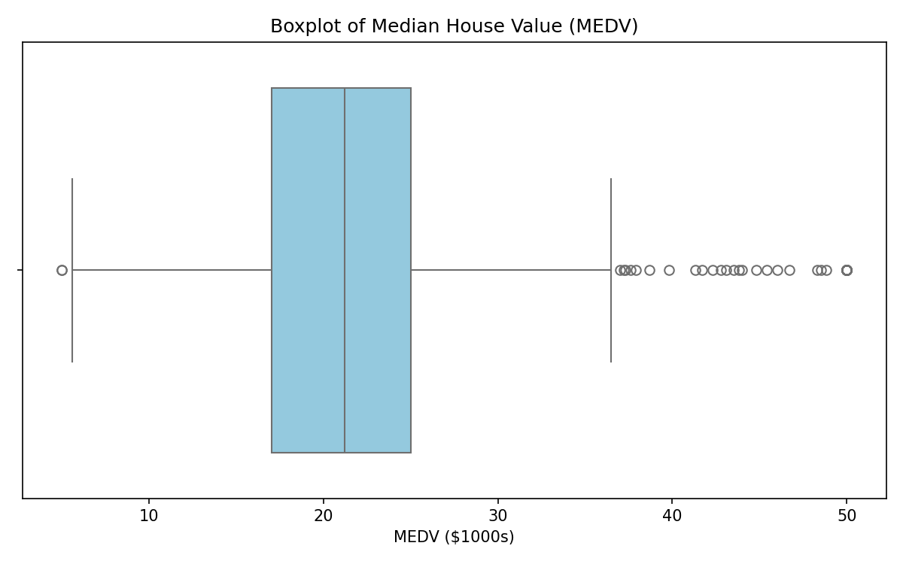
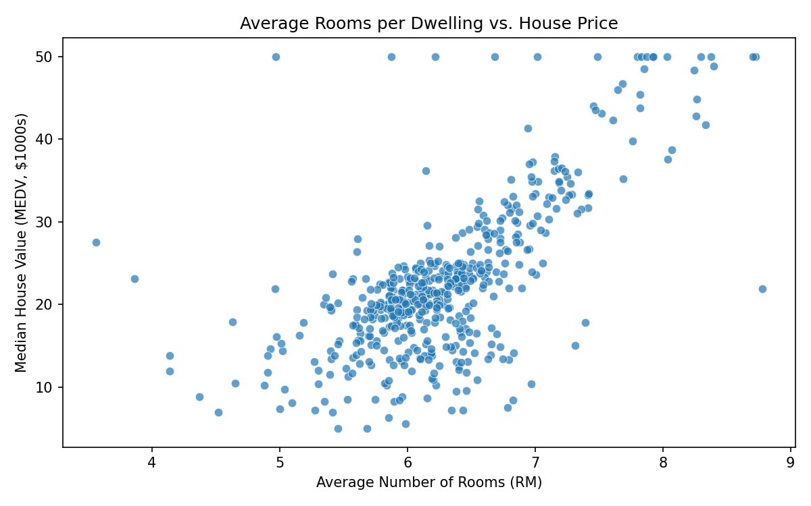
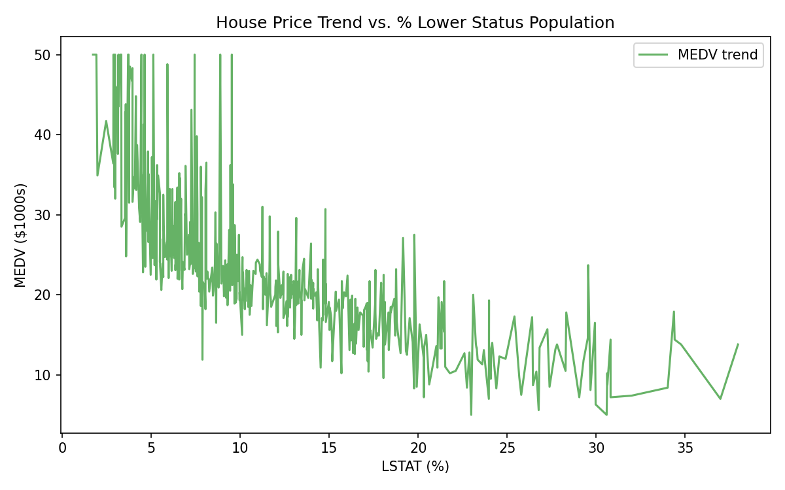

# Codveda Data Analytics Internship – Level 1

**Domain:** Data Analytics  
**Dataset:** Boston Housing Dataset (`cleaned_house_data.csv`)  
**Tools:** Python, pandas, matplotlib, seaborn  

This repository contains the completed Level 1 tasks for the Codveda Technology Data Analytics Internship.

---

## Project Overview

The Boston Housing dataset contains information about housing in the Boston area.  
Key features include:
- `CRIM` – per capita crime rate
- `ZN` – proportion of residential land zoned for large lots
- `INDUS` – proportion of non-retail business acres
- `CHAS` – Charles River dummy variable (1 = tract bounds river)
- `NOX` – nitric oxides concentration
- `RM` – average number of rooms per dwelling
- `AGE` – proportion of owner-occupied units built prior to 1940
- `DIS` – weighted distances to employment centres
- `RAD` – index of accessibility to radial highways
- `TAX` – full-value property-tax rate per $10,000
- `PTRATIO` – pupil-teacher ratio
- `B` – proportion of Black residents
- `LSTAT` – % lower status of the population
- `MEDV` – Median value of owner-occupied homes in $1000s (target variable)

---

## Task 1: Data Cleaning and Preprocessing

**Objectives completed:**
- Loaded the dataset using pandas
- Handled missing values
- Removed duplicate rows
- Standardized data formats

**Output:**  
`cleaned_house_data.csv` – clean version of the original Boston Housing dataset ready for analysis.

---

## Task 2: Exploratory Data Analysis (EDA)

**Objectives completed:**
- Calculated summary statistics (mean, median, std, etc.)
- Visualized data distributions
- Identified correlations between numerical features

### 1. Histograms of All Features


**Insight:**  
Most features are right-skewed (e.g., CRIM, LSTAT). `RM` and `MEDV` are approximately normal. `CHAS` is highly imbalanced (most houses are not near the Charles River).

### 2. Boxplot of Median House Value (MEDV)


**Insight:**  
The median house price is around $21–22k. There are many high-value outliers above $37k (capped at $50k in the original dataset).

### 3. Correlation Matrix of Features


**Key Correlations with MEDV (House Price):**
| Feature | Correlation with MEDV | Interpretation                  |
|---------|-----------------------|---------------------------------|
| RM      | **+0.70**             | Strong positive – more rooms → higher price |
| LSTAT   | **-0.74**             | Strong negative – higher % lower status → lower price |
| PTRATIO | -0.51                 | Moderate negative               |
| INDUS   | -0.48                 | Moderate negative               |
| TAX     | -0.47                 | Moderate negative               |
| NOX     | -0.43                 | Moderate negative               |

**Other strong correlations:**
- `RAD` ↔ `TAX` (0.91)
- `NOX` ↔ `INDUS` (0.76)
- `AGE` ↔ `DIS` (-0.75)

### 4. Average Rooms vs House Price


**Insight:**  
Clear positive linear relationship. Houses with more rooms tend to have significantly higher median values.

---

## Task 3: Basic Data Visualization

**Objectives completed:**
- Created bar plots, line charts, and scatter plots
- Customized titles, labels, and legends
- Exported all plots as high-quality images

### 1. Average House Price: Near Charles River vs Not


**Insight:**  
Houses that bound the Charles River (`CHAS = 1`) have a noticeably higher average price (~$28k) compared to those that do not (~$22k).

### 2. Property Tax Rate vs House Price


**Insight:**  
Most properties have tax rates between 200–400. A large cluster of high-tax properties (TAX ≈ 666) shows a wide range of prices, many of them lower-valued.

### 3. House Price Trend vs % Lower Status Population


**Insight:**  
Strong negative relationship. As the percentage of lower-status population increases, median house prices decrease sharply.

---

## Key Findings Summary

1. **Most important predictors of house price:**
   - Number of rooms (`RM`) → positive impact
   - % lower status population (`LSTAT`) → strong negative impact

2. **Location matters:**
   - Proximity to the Charles River increases average house value.

3. **Socio-economic factors:**
   - Higher crime rate, higher tax, higher industrial proportion, and higher pupil-teacher ratio are associated with lower house prices.

4. **Data quality:**
   - The cleaned dataset is ready for further modeling (Level 2 & 3 tasks).

---

## How to Reproduce

```bash
# Install dependencies
pip install pandas matplotlib seaborn

# Run the analysis scripts (example)
python data_cleaning.py
python eda_analysis.py
python visualizations.py
